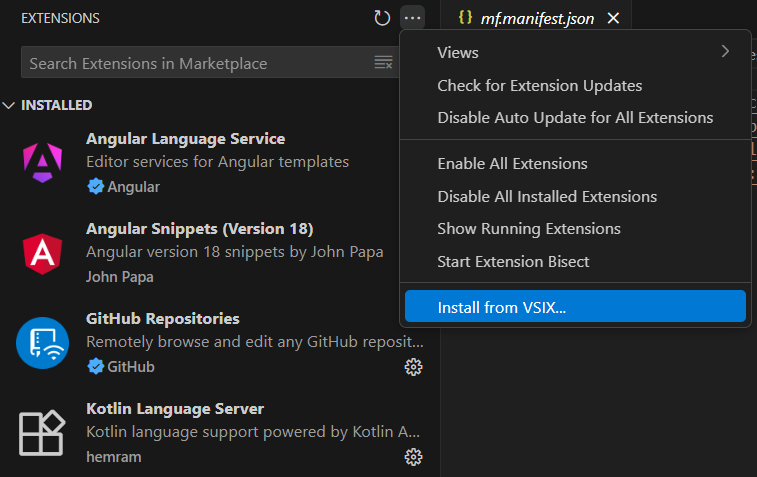

# Kotlin Language Server

This is a fork of [amgdev9/kotlin-lsp](https://github.com/amgdev9/kotlin-lsp) which is an implementation of the [Language Server Protocol](https://microsoft.github.io/language-server-protocol/specification) for the [Kotlin](https://kotlinlang.org) programming language, leveraging the Kotlin [Analysis API](https://github.com/JetBrains/kotlin/blob/master/docs/analysis/analysis-api/analysis-api.md) to provide real time diagnostics, syntax and semantic analysis of Kotlin source files and libraries.

It's developed as part of the [Kotlin LSP Project](https://kotlinlang.org/docs/gsoc-2025.html#kotlin-language-server-lsp-hard-350-hrs) of [Google Summer of Code](https://summerofcode.withgoogle.com) 2025 under [Kotlin Foundation](https://kotlinfoundation.org) 

## Packages

You can download the latest release assets from the [GitHub Releases](https://github.com/h4-mm-3r/kotlin-lsp/releases) page.

*   **VSCode Extension (`.vsix`)**: [kotlin-lsp-vscode-2.0.0.vsix](https://github.com/h4-mm-3r/kotlin-lsp/releases/download/v2.0/kotlin-lsp-vscode-2.0.0.vsix)
*   **Language Server Executable (`.zip`)**: [kotlin-lsp-2.0.0.zip](https://github.com/H4-MM-3R/kotlin-lsp/releases/download/v2.0/kotlin-lsp-2.0.zip)


## Installation:

### Neovim: 
create a file in your `<YOUR_NEOVIM_CONFIG_DIRECTORY>/after/plugin/kotlin.lua`
and add the below lines in your `kotlin.lua`
```lua
local root_dir = vim.fs.root(0, {"settings.gradle.kts", "settings.gradle"})
if not root_dir then
    root_dir = vim.fs.root(0, {"build.gradle.kts", "build.gradle"})
end

vim.lsp.config['kotlinlsp'] = {
     cmd = { '<YOUR_KOTLIN_LSP_DIRECTORY>/lsp-dist/kotlin-lsp-1.5/bin/kotlin-lsp' },
    -- if you want to connect through tcp use --tcp flag
    -- cmd = vim.lsp.rpc.connect('0.0.0.0', tonumber(2090)),
    filetypes = { 'kotlin' },
    root_dir = root_dir
}

vim.lsp.enable('kotlinlsp')
```
Now you can directly open any file of a project to start the LSP

### VSCode:

*    Download the .vsix extension from [Releases](https://github.com/h4-mm-3r/kotlin-lsp/releases/download/v1.5/kotlin-lsp-vscode-1.5.0.vsix) or [Build it from source](#references)
*    Open the Extensions Tab and `Click on Install from VSIX`



Now you can directly open any file of a project to start the LSP

# References

*  #### see [Building from source](docs/build_from_source.md) to build the packages from source.
* #### see  [Roadmap](docs/roadmap.md) for current progress of the project.
